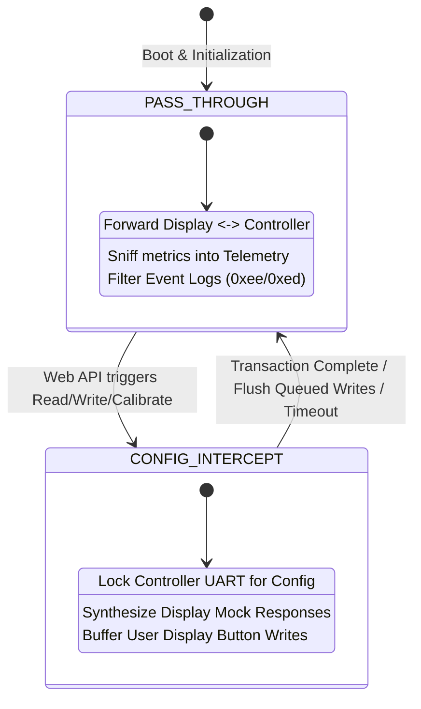

# AGENTS.md: Developer & Agent Handoff Reference

This document is the architectural and technical specification for AI agents and developers maintaining, refactoring, or extending the **BBS-HD ESP32-S3 Serial Middleman** codebase.

---

## 1. Project Domain & Context

* **Target Application**: Inline serial bridge and Wi-Fi management server for Bafang BBS-HD and BBS02 mid-drive electric bike motors running the third-party open-source firmware **[`bbs-fw`](https://github.com/danielnilsson9/bbs-fw)**.
* **Target Hardware**: ESP32-S3 (44-pin DevKitC-1 or equivalent, dual-core Xtensa LX7 @ 240MHz, 8MB Flash).
* **Physical Topology**:
  ```
  [ Bafang HMI Display ] <=== 5V TTL ===> [ Level Shifter ] <=== 3.3V ===> [ ESP32-S3 UART2 ]
  [ Bafang Motor Ctrl  ] <=== 5V TTL ===> [ Level Shifter ] <=== 3.3V ===> [ ESP32-S3 UART1 ]
                                                                             [ ESP32-S3 Wi-Fi ] <---> Phone / Laptop
  ```
* **Electrical Constraints**:
  * Motor/Display UARTs run at **5V TTL logic**. ESP32-S3 GPIOs are **3.3V max**. Level shifting is mandatory.
  * Baud rate is **1200 baud, 8N1** (1 byte $\approx$ 8.33 ms).
  * Battery Pack Voltage on Pin 1 is **36V–58.8V DC**. It must only feed the high-voltage DC-DC buck converter to supply 5V to the ESP32.

---

## 2. Core Architecture & State Machine

The middleman operates under a strict arbitration state machine defined in [`include/SerialBridge.h`](file:///home/kyle/dev/bbs-hd-middleman/include/SerialBridge.h):



### Mode 1: `BridgeState::PASS_THROUGH` (Normal Operation)
* **Display $\to$ Controller**:
  * Display queries (e.g. `0x11 0x08`, `0x11 0x20`) and writes (`0x16 0x0b`, `0x16 0x1a`) are forwarded directly to the controller.
  * Writes are inspected to immediately update local telemetry (`assistLevel`, `lightsOn`, `operationMode`).
* **Controller $\to$ Display**:
  * Response bytes are forwarded to the display.
  * Controller responses update telemetry (`motorCurrentAmps`, `batteryPercent`, `speedRpm`, `batteryVoltage`, `statusCode`).
  * **Event Log Interception**: `bbs-fw` sends asynchronous event logs (`0xee` 3-byte and `0xed` 5-byte frames). These are parsed, pushed to the web UI event log, and **swallowed** (not forwarded to the display) because standard displays do not support these frames and may glitch.

### Mode 2: `BridgeState::CONFIG_INTERCEPT` (Web Configuration)
* Triggered when the web interface calls `readConfig`, `writeConfig`, `resetConfig`, or `calibrateVoltage`.
* **Problem Solved**: At 1200 baud, transmitting a full 154-byte configuration payload takes $\sim 1.35$ seconds. If the display polls the controller during this window, packets collide and corrupt EEPROM. If the display is left unanswered for $> 1.5$ seconds, it triggers **Error 30**.
* **Arbitration Solution**:
  1. Middleman asserts `_state = CONFIG_INTERCEPT` and acquires `_bridgeMutex`.
  2. While communicating with the controller, incoming display read queries (`0x11 ...`) are intercepted.
  3. **Mock Synthesizer**: `synthesizeDisplayResponse(opcode)` immediately generates a valid, checksummed response to the display using cached telemetry. Display responds smoothly in $< 2$ ms with **zero Error 30**.
  4. If the user presses buttons on the display (write commands `0x16 ...`), they are buffered in `_queuedWrites[]`.
  5. Once the controller transaction completes, queued display commands are flushed to the controller, and state returns to `PASS_THROUGH`.

---

## 3. Protocol Specifications

### Checksum Algorithm
All packets (controller and display) utilize a simple 8-bit sum modulo 256:
$$\text{Checksum} = \left( \sum_{i=0}^{N-1} \text{byte}_i \right) \pmod{256}$$

### Controller Config Protocol (`bbs-fw`)
| Operation | Request Frame | Response Frame |
| :--- | :--- | :--- |
| **Read FW Version** | `0x01, 0x01, 0x02` | `0x01, 0x01, <maj>, <min>, <pat>, <cfgVer>, <ctrlType>, <chk>` (8 bytes) |
| **Read Config** | `0x01, 0x03, 0x04` | `0x01, 0x03, <version=5>, <len=154>, [154 config bytes], <chk>` (159 bytes) |
| **Write Config** | `0x02, 0xf1, 0x05, 0x9a, [154 config bytes], <chk>` | `0x02, 0xf1, <status: 1=OK, 0=Fail>, <chk>` (4 bytes) |
| **Reset Config** | `0x02, 0xf2, 0xf4` | `0x02, 0xf2, <status>, <chk>` (4 bytes) |
| **Calibrate Voltage** | `0x02, 0xf3, <v_hi>, <v_lo>, <chk>` | `0x02, 0xf3, <v_hi>, <v_lo>, <chk>` (5 bytes) |
| **Event Log Enable** | `0x02, 0xf0, <1/0>, <chk>` | `0x02, 0xf0, <1/0>, <chk>` (4 bytes) |

### Display Protocol (`Bafang HMI`)
| Query / Command | Opcode | Bytes | Description / Synthesizer Format |
| :--- | :---: | :---: | :--- |
| Read Status | `0x08` | 2 | Returns 1 byte status code (`0x00` = OK) |
| Read Current | `0x0a` | 2 | Returns `[amps * 2, amps * 2]` (2 bytes) |
| Read Battery | `0x11` | 2 | Returns `[percent, percent]` (2 bytes) |
| Read Speed | `0x20` | 2 | Returns `[rpm_hi, rpm_lo, chk + 0x20]` (3 bytes) |
| Read Moving | `0x31` | 2 | Returns `[0x30 or 0x31, chk]` (2 bytes) |
| Read Voltage | `0x24` | 3 | Returns `[volt_x10_hi, volt_x10_lo, chk]` (3 bytes) |
| Write PAS | `0x0b` | 4 | `0x16, 0x0b, <level_code>, <chk>` |
| Write Mode | `0x0c` | 4 | `0x16, 0x0c, <0x02=Std, 0x04=Sport>, <chk>` |
| Write Lights | `0x1a` | 3 | `0x16, 0x1a, <0xf0=Off, 0xf1=On>` |

### Debug Telemetry Frame (`0xEC`, bbs-fw fork)
The fork's `app_process()` periodically (every `DEBUG_TELEMETRY_INTERVAL_MS`, 500 ms) calls `eventlog_write_telemetry()` so the middleman can display live motor targets that the display protocol never exposes:

```
0xEC, target_current_percent, target_speed_percent,
     cadence_rpm_x10_hi, cadence_rpm_x10_lo,
     motor_rpm_x10_hi, motor_rpm_x10_lo,
     rider_torque_dnm_hi, rider_torque_dnm_lo,
     load_bias_dnm_hi, load_bias_dnm_lo,
     load_flags, checksum
```
Thirteen bytes including the checksum. It grew from eight when the virtual load
sensing estimator was added; at the 500 ms emit interval it occupies about 11% of
the 1200 baud controller<->display link.

* `rider_torque_dnm` is the estimated torque the rider is actually transmitting
  through the crank clutch, in Nm x10, signed. This is the virtual torque sensor
  output; see `bbs-fw/src/firmware/loadsensor.h` for the full derivation.
* `load_bias_dnm` is the identified grade/rolling load bias the estimate is
  derived against, Nm x10, signed. Useful for checking the model against a known
  road.
* `load_flags` carries `LOAD_FLAG_*` (see `BbsFwProtocol.h`) plus a 2 bit
  confidence field in bits 5-6. Confidence 0 means no coast has been observed
  since power-on, so the load reference is still a nominal prior and the reading
  must not be trusted on a climb.

* `target_current_percent` / `target_speed_percent` are the final `motor_set_target_current()` / `motor_set_target_speed()` values (0–100).
* `cadence_rpm_x10` is `pas_get_cadence_rpm_x10()` (pedal cadence × 10).
* `motor_rpm_x10` is `hall_get_motor_rpm_x10()`: the motor output shaft speed × 10, measured from the three motor hall signals, which are wired to both the NEC motor controller and the STC. It is reported in output shaft (chainring / crank equivalent) rpm so it is directly comparable to the pedal cadence, and reads zero when the motor is not turning or on controllers whose hall routing has not been traced.
* Checksum is the usual 8-bit sum over the first seven bytes.
* It is only emitted while the event log is enabled (the middleman enables it at boot via `enableEventLog(true)`).
* The middleman parses it in both bridge paths — `processControllerRxPassThrough()` and `consumeControllerEventFrame()` — updates `TelemetryTracker::updateTargetTelemetry()`, and **swallows** it like the other event frames (never forwarded to the display). `/api/telemetry` exposes `hasTargetTelemetry`, `targetCurrentPercent`, `targetSpeedPercent`, `cadenceRpm`, `motorRpm`, `riderTorqueNm`, `loadBiasNm`, `loadValid`, `loadConfidence`, `loadClutchLocked`, `loadAnchored` and `loadSaturated`, which the dashboard "Motor Targets (bbs-fw)" card renders.

### Binary Configuration Struct Layout (Version 5, 154 Bytes)
Defined in [`include/BbsFwProtocol.h`](file:///home/kyle/dev/bbs-hd-middleman/include/BbsFwProtocol.h):
* Header fields: 34 bytes (limits, ramp rate, voltages, sensor enables, throttle bounds, PAS delays).
* `standard_levels[10]`: $10 \times 6 = 60$ bytes (`AssistLevel`: flags, current%, throttle%, cadence%, speed%, torque_amp).
* `sport_levels[10]`: $10 \times 6 = 60$ bytes.
* Total size: $34 + 60 + 60 = 154$ bytes (`#pragma pack(push, 1)`).

**Current firmware target: version 5.** The bbs-fw tree in use is based on commit `10cadba` (config version 5), so v5 is the layout that will actually be seen on the wire. The v6 support below is retained and version-gated but currently unused; no build-time switch is needed because the layout is chosen from the version the controller reports.

### Binary Configuration Struct Layout (Version 6, 192 Bytes)
Config v6 (bbs-fw fork commit "per-assist-level PAS min current and cadence taper, display target current") is **not** a superset of v5:
* Header fields: 32 bytes — the global `pas_keep_current_percent` / `pas_keep_current_cadence_rpm` are removed.
* `standard_levels[10]` / `sport_levels[10]`: $2 \times 10 \times 8 = 160$ bytes (`AssistLevelV6`: flags, max_current%, min_current%, taper_start_cadence_rpm, taper_end_cadence_rpm, max_throttle%, max_speed%, torque_amp).
* New flag `ASSIST_FLAG_DISPLAY_TARGET_CURRENT = 0x80` (show target current on the display instead of speed).
* `assist_mode_select` gains values 3–12 (`PASn + Lights toggles mode`) and 13 (`Brake switch toggles mode on boot`); v5 only knows 0–2.
* Total size: $32 + 160 = 192$ bytes.

**Version-aware tooling (critical):** the firmware only accepts a write whose `version`/`length` match its own `CONFIG_VERSION`, so the tool detects the controller version and switches layout:
* `SerialBridge::readConfig`/`writeConfig` take a version-tagged `BbsFwConfig` (`version`, `v5`, `v6` views) and frame v4 (152), v5 (154) or v6 (192) accordingly.
* `_configVersion` is learned from the FW-version response and the read-config header; `getConfigVersion()` is authoritative.
* `serializeConfigToJson`/`deserializeConfigFromJson` emit/consume the field set for `cfg.version` (`current`/`cadence` + global keep-current for v4/v5; `maxCurrent`/`minCurrent`/`taperStartCadence`/`taperEndCadence`/`displayTargetCurrent` for v6).
* `handlePostConfig` returns HTTP 409 if the posted `configVersion` differs from the controller's, so importing a v6 profile while attached to a v5 controller cannot zero the EEPROM.
* The web UI rebuilds its assist-level table columns from `configVersion` (`buildLevelTables(version)`), hides the global keep-current fields for v6, and extends the assist-mode options for v6.

### Wi-Fi Management (`WebPortal`)
The ESP32-S3 has a **single 2.4 GHz radio**, so AP+STA coexistence is slow. The portal is therefore **station-first**:
* If station credentials are stored, it joins the router in `WIFI_STA` only. On success it stays STA and the SoftAP + DNS captive portal are torn down.
* If the join does not complete within `STA_CONNECT_TIMEOUT_MS`, it runs an **async** channel scan (`WiFi.scanNetworks(true, true)`, never a blocking scan in `loop()`) and brings up a SoftAP on the least-congested of channels 1/6/11.
* If the station link drops, it waits `STA_LOST_GRACE_MS` for auto-reconnect before falling back to the SoftAP. Once on the SoftAP it does not retry the station until the user submits credentials again.
* Wi-Fi power save goes through `applyWifiPowerSave()` in [`src/WebPortal.cpp`](file:///home/kyle/dev/bbs-hd-middleman/src/WebPortal.cpp) — **never call `WiFi.setSleep(false)` directly**. With the BLE transport compiled in it must stay at `WIFI_PS_MIN_MODEM`, because the Wi-Fi driver aborts on `WIFI_PS_NONE` while Bluetooth is enabled. BLE-free builds keep `WIFI_PS_NONE` for the lowest dashboard latency.
* The DNS server (`_dnsServer`, wildcard to the AP IP) runs **only while `_apActive`**. Captive-portal redirects (including `handleNotFound`) are likewise AP-only; in STA mode unknown paths return a real 404 so API typos stay debuggable.
* mDNS is advertised as `http://<MDNS_HOSTNAME>.local/` (default `bbshd.local`) in both modes via `MDNS.begin()`; the hostname and current mode are exposed by `/api/info`.
* All lifecycle work happens non-blockingly in `WebPortal::process()` driven by the `WifiPhase` state machine (`StaConnecting` → `StaConnected` / `ApScanning` → `ApOnly`). Never add a blocking wait here — it would stall `Bridge.process()` and overrun the 1200-baud UART.

### Bluetooth LE Transport (`BlePortal`)
The dashboard is normally reached over Wi-Fi, but a page loaded over **HTTPS** cannot call `http://192.168.4.1` (mixed content) and Web Bluetooth requires a **secure context** the ESP32 cannot provide. The hosted copy therefore reaches the bike over BLE GATT. This is additive: the on-device HTTP copy remains the universal fallback and is the only option on iOS Safari, which has no Web Bluetooth at all.

**`Ble.begin()` MUST run before `Portal.begin()` in `setup()`.** This is not a preference and not about memory — it is a hard requirement of this toolchain:

* Arduino-ESP32 2.0.17 ships IDF 4.4, where `coex_enable()` **aborts** inside `esp_bt_controller_enable()` if `esp_wifi_set_ps(WIFI_PS_NONE)` has already been called (IDFGH-8094: [esp-idf#9595](https://github.com/espressif/esp-idf/issues/9595), [NimBLE-Arduino#437](https://github.com/h2zero/NimBLE-Arduino/issues/437)).
* `WebPortal` calls `WiFi.setSleep(false)` — i.e. `WIFI_PS_NONE` — for dashboard latency, and it does so in `setupWifi()`, i.e. inside `Portal.begin()`.
* Enabling Wi-Fi first therefore guarantees the abort. The observed failure: the bike's display throws a communication error, because `setup()` dies before `loop()` ever runs and the 1200-baud pass-through never starts. The decoded backtrace ends `abort() ← coex_core_enable ← coex_enable ← esp_bt_controller_enable ← btStart ← BLEDevice::init ← BlePortal::begin ← setup`.
* Diagnosis is not obvious from the surface symptom, so if the bridge is ever dead *and* the display is erroring, check that Bluetooth is enabled before Wi-Fi rather than chasing the UART code. Total free heap is a red herring — the failing build had 220 KB free with a 205 KB contiguous block.

**Modem sleep must also stay enabled while BLE is compiled in.** This is the second half of the same constraint, and fixing only the ordering produces a second abort:

* With Bluetooth up, requesting `WIFI_PS_NONE` aborts inside `pm_set_sleep_type()` (`wifi_set_ps_process ← ieee80211_ioctl_process ← ppTask`) with the driver logging `E wifi: Error! Should enable WiFi modem sleep when both WiFi and Bluetooth are enabled!!!!!!`
* All four power-save call sites therefore go through `applyWifiPowerSave()` in [`src/WebPortal.cpp`](file:///home/kyle/dev/bbs-hd-middleman/src/WebPortal.cpp) instead of calling `WiFi.setSleep(false)` directly: `WIFI_PS_MIN_MODEM` when BLE is compiled in, `WIFI_PS_NONE` when it is not.
* The symptom is identical to the ordering abort — `setup()` dies, `loop()` never runs, the display throws a communication error — so treat "bridge dead + display erroring" as a radio-initialisation problem, never a UART one.

* **Stack**: Bluedroid (`BLEDevice.h`), the only BLE stack the precompiled `espressif32@6.12.0` SDK ships (`libbt.a`; there is no NimBLE library in that core). Guarded by `BLE_TRANSPORT_ENABLED` in [`Config.h`](file:///home/kyle/dev/bbs-hd-middleman/include/Config.h) — set it to `0` to drop roughly 700 KB flash / 30 KB RAM.
* **Cost**: with BLE enabled the image is about 46% of the 3.19 MB app partition and 27.6% of DRAM. Both OTA slots still fit.
* **Device name**: `BLE_DEVICE_NAME` (`BBSHD-Middleman`). The service UUID is advertised so `navigator.bluetooth.requestDevice({filters:[{services:[...]}]})` can match it.
* **UUIDs and frame layout** live in [`include/BleProtocol.h`](file:///home/kyle/dev/bbs-hd-middleman/include/BleProtocol.h) and are duplicated verbatim in `web/index.html`. Change them in both places or discovery silently stops working.

| Characteristic | Props | Payload |
| :--- | :--- | :--- |
| `…0002` INFO | Read | `{"protocol":1,"name":…,"fw":…}` — fixed; dynamic values come from `/api/info` |
| `…0003` REQUEST | Write, WriteWithoutResponse | `u16 seq \| u8 method \| u8 rsvd \| u16 pathLen \| u16 bodyLen \| path \| body` |
| `…0004` RESPONSE | Notify | `u16 seq \| u16 status \| u16 totalLen \| body slice` |

* Both directions are **byte streams**, not single packets: a v6 config body is ~3 KB, well past even a 517-byte ATT MTU. The client writes consecutive slices and the device notifies consecutive slices; each side reassembles in order. The response header repeats on every slice so each notification is self-describing.
* `seq` is echoed from the request. Sequence numbers are **split by direction**: replies use `1..BLE_REQUEST_SEQ_MAX` (0x7FFF), device pushes use `BLE_PUSH_SEQ_BASE` (0x8000)`..0xFFFF`, so a push can never be mistaken for a reply.
* Notify chunking follows the negotiated MTU (`BLEServer::getPeerMTU()` minus the 3-byte ATT header, capped at `kMaxNotifyChunk`). The browser cannot read the MTU, so it starts at 200 bytes and halves on a failed first write.
* **Threading (critical)**: the GATT callbacks run on the **Bluedroid task**. They do nothing but append bytes to a mutex-protected ring and flip a `_connected` flag. `BlePortal::process()` — called from `loop()` — reassembles the request, calls `Portal.dispatchApi()` and notifies the reply. Never dispatch an API call from a callback: the handlers drive the 1200-baud bridge and a config write holds `CONFIG_INTERCEPT` for over a second.
* A half-received request and the pending queue are discarded on disconnect.

**Browser support is not "all Chromium".** Chromium *the engine* implements Web Bluetooth, but the browser has to expose it:
* Chrome / Edge desktop and Chrome Android: available; this is the target.
* **Brave ships it disabled**, so `navigator.bluetooth` is `undefined`. The user must turn on `brave://flags/#enable-web-bluetooth` or launch with `--enable-features=WebBluetooth`. Brave also exposes a `DefaultWebBluetoothGuardSetting` enterprise policy.
* Safari (all platforms) and Firefox: no Web Bluetooth. iOS can only get there through a third-party browser (Bluefy, WebBLE), which is not worth documenting as a supported path.
* Never infer the API from the user agent — `bleSupported()` feature-detects and the page shows **BT: Unsupported** rather than a button that cannot work.

### BLE Push Notifications
Replies and pushes share the RESPONSE characteristic and are told apart by the sequence range. For a push the `status` field carries the push kind instead of an HTTP status:

| Push | `status` | Cadence |
| :--- | :--- | :--- |
| Live telemetry | `BLE_PUSH_TELEMETRY` (1) | every `BLE_TELEMETRY_PUSH_MS` (1 s) while connected |
| Event log | `BLE_PUSH_EVENTS` (2) | only when `TelemetryTracker::getEventSeq()` moves |

* `TelemetryTracker::_eventSeq` is a **monotonic** counter (unlike `_eventCount`, which saturates at `MAX_EVENT_LOG_ENTRIES`), so "has anything happened" stays answerable after the ring buffer wraps. A quiet bike generates no event traffic at all.
* Both push kinds are built by `Telemetry.buildTelemetryJson()` / `buildEventsJson()` — the exact builders `/api/telemetry` and `/api/events` use, so a push and a poll can never disagree.
* On connect, `_lastTelemetryPushMs` is back-dated so a full snapshot goes out immediately, and `_havePushedEvents` is cleared so the new client always receives the existing log.
* **Each push carries its own incrementing seq** rather than a fixed id. The client reassembles pushes per message (`Ble.pushBuf`), so a partially delivered push self-heals when the next one arrives instead of corrupting a shared buffer. A single dropped ATT notification is therefore survivable — which matters because Bluedroid drops notifications rather than blocking when its TX queue is full.
* The client renders pushes through the *same* `renderTelemetry()` / `renderEvents()` that the pollers use; `pollTelemetry()` and `pollEvents()` simply call those after a fetch.
* The pollers stand down only while pushes are healthy (`blePushesHealthy()`: connected and a push within `BLE_PUSH_STALE_MS`). If pushes dry up — link trouble, congestion — polling resumes on its own rather than leaving the dashboard frozen.

### BLE Authentication (PIN)
BLE GATT has no notion of "who is connecting". Without a gate, anyone in radio range can pair and rewrite the controller's EEPROM, which is a bad thing to have happen at a traffic light. The transport therefore enforces a PIN.

* The PIN lives in NVS (`bbshd-cfg` / `ble_pin`) and is owned by [`WebPortal`](file:///home/kyle/dev/bbs-hd-middleman/include/WebPortal.h) — `getBlePin()` / `setBlePin()` — because WebPortal already owns device settings and NVS. **An empty PIN means the BLE API is open**, which is the default so an existing device keeps working.
* `/api/auth` (`BLE_AUTH_PATH`) is a **BLE-only** route and is deliberately *not* in `API_ROUTES`. `BlePortal::dispatchOne()` intercepts it before dispatch. While a PIN is set and the connection is unauthenticated, every other route gets `401` and no data is pushed.
* The gate is **transport-specific on purpose**: the Wi-Fi/HTTP page is never gated, because reaching it already requires being on the bike's own network or access point — and that page is the recovery path if the PIN is forgotten. It hosts the set/clear control via `/api/ble-pin` (also in `API_ROUTES`, so the hosted BLE page can use the same control once authenticated).
* `GET /api/ble-pin` reports only `pinSet`/`bleEnabled`; it never returns the PIN. `POST` accepts `{"pin":"..."}` (4–16 characters) and an empty string clears it.
* `_authenticated` is **per connection** and cleared every time a link comes up. `_authFailures` deliberately is **not** — reconnecting does not buy a fresh budget. After `BLE_AUTH_MAX_ATTEMPTS` (5) the transport refuses for `BLE_AUTH_LOCKOUT_MS` (30 s) with `429`.
* The dashboard stores the PIN in `localStorage` (`bbshd.ble.pin`) and sends it automatically; if the device rejects it, the user is prompted once, and a second failure aborts the connection rather than leaving an unusable link up.
* **Not covered:** the HTTP API is unauthenticated by design (see above), and the BLE link itself is not encrypted — there is no bonding/passkey, so the PIN is protection against casual tampering, not against a determined attacker with a radio sniffer. Bonding would be the next step if that matters.

### Web UI Polling Budget
Over HTTP the dashboard polls `/api/telemetry` (1.5 s) and `/api/events` (3 s). **Over Bluetooth neither poll runs** while pushes are healthy: telemetry arrives pushed at 1 s and the event log is pushed only on change, so the dashboard is both fresher and quieter than its HTTP equivalent. The Debug Console poll (`/api/serial-trace`, 0.5 s) still runs on both transports, and only while the toggle is on and its tab is visible. All polling functions bail out when `document.hidden`. `DebugLog` tracing is disabled by default (`DEBUG_TRACE_ENABLED_DEFAULT 0`) so an idle device generates no trace traffic.

### Dashboard Sources & Build Pipeline (critical)
The dashboard has **one source of truth: [`web/index.html`](file:///home/kyle/dev/bbs-hd-middleman/web/index.html)**. The same file is delivered two ways:

* **On-device** — `tools/embed_web.py` wraps it in a PROGMEM raw string literal and writes `include/WebContent.h`, which `WebPortal` serves at `/`. This runs as a PlatformIO pre-script (`extra_scripts = pre:tools/embed_web.py`), so the header is regenerated before every build.
* **Hosted** — GitHub Pages serves `web/` over HTTPS (see [`.github/workflows/pages.yml`](file:///home/kyle/dev/bbs-hd-middleman/.github/workflows/pages.yml)), which makes it a secure context so `navigator.bluetooth` exists. That copy talks BLE; `web/sw.js` caches the shell so it opens with no network at all.

`include/WebContent.h` is **generated** and committed only so a checkout always compiles. Editing it directly is pointless: the next build silently reverts you. Edit `web/index.html` and run `python3 tools/embed_web.py` (or just build).

Keep the page honest about where it runs: `isHostedCopy()` (HTTPS means hosted — the ESP32 only serves plain HTTP) gates both the PWA wiring (`initPwa()`) and the default transport. The manifest, service worker and icons are **not** served by the ESP32, so the device copy must never request them.

**Never call `sys.exit()` from a PlatformIO pre-script.** `SystemExit` propagates out of the SConscript and terminates SCons with a *clean* status, so `pio run` prints `SUCCESS` in ~0.5 s without compiling anything. If a build finishes suspiciously fast, check that it actually recompiled.

### Transport-Neutral API
Every dashboard call goes through `apiFetch()` in `web/index.html`, which is the single choke point between the UI and the backend. On the wire the API is one implementation shared by both transports:

* `API_ROUTES[]` in [`src/ApiHandlers.cpp`](file:///home/kyle/dev/bbs-hd-middleman/src/ApiHandlers.cpp) is the route table. `WebPortal::setupRoutes()` registers one HTTP handler per row and `WebPortal::dispatchApi()` switches on the matching `ApiRouteId`, so the HTTP and BLE transports cannot diverge.
* Route handlers never touch `_server` for an API reply. They call `sendApi()`, which either writes to the HTTP socket or captures into an `ApiResponse` when the BLE transport is driving. This is why one handler body serves both transports byte-for-byte.
* `dispatchApi()` must be called from `loop()` only — **never from a Bluetooth callback**. The handlers drive the 1200-baud bridge (a config write holds `CONFIG_INTERCEPT` for over a second) and the capture sink is not thread-safe.

---

## 4. Codebase Navigation

```
/home/kyle/dev/bbs-hd-middleman/
├── platformio.ini         # PlatformIO build config (espressif32@6.12.0, ESP32-S3 DevKitC-1)
├── README.md              # Human-facing guide (BOM, wiring diagrams, user manual)
├── AGENTS.md              # This file (Agent handoff reference & technical specs)
├── .github/workflows/
│   └── pages.yml          # Publishes web/ to GitHub Pages (the HTTPS/BLE copy)
├── tools/
│   ├── embed_web.py       # Generates include/WebContent.h from web/index.html
│   └── make_icons.py      # Generates the PWA icons in web/icons/
├── web/                   # Hosted dashboard: served by GitHub Pages AND embedded below
│   ├── index.html         # SINGLE SOURCE OF TRUTH for the dashboard SPA
│   ├── manifest.webmanifest
│   ├── sw.js              # Cache-first shell so the hosted copy opens offline
│   └── icons/             # Generated by tools/make_icons.py
├── include/
│   ├── Config.h           # Hardware pins, Wi-Fi credentials, timeouts, buffer sizes
│   ├── ApiHandlers.h      # Transport-neutral ApiRequest/ApiResponse + route table
│   ├── BleProtocol.h      # GATT UUIDs + BLE frame layout (mirrored in web/index.html)
│   ├── BlePortal.h        # BLE GATT server, deferred API dispatch
│   ├── BbsFwProtocol.h    # Opcodes, structs, bitmasks, checksums, JSON serialization
│   ├── Telemetry.h        # Thread-safe metrics tracker & event log ring buffer
│   ├── SerialBridge.h     # Dual UART engine, state machine, mock synthesizer
│   ├── WebContent.h       # GENERATED from web/index.html -- do not edit
│   └── WebPortal.h        # WebServer, REST APIs, DNS Captive Portal, Wi-Fi manager
└── src/
    ├── main.cpp           # Setup, cooperative loop, status LED heartbeat
    ├── ApiHandlers.cpp    # API_ROUTES table + route/query helpers
    ├── BlePortal.cpp      # Bluedroid GATT server, request reassembly, notify chunking
    ├── BbsFwProtocol.cpp  # JSON <-> struct converters, event log string table
    ├── Telemetry.cpp      # Metric calculations, speed math, JSON builder
    ├── SerialBridge.cpp   # Non-blocking UART streaming, arbitration logic
    └── WebPortal.cpp      # HTTP route endpoints, captive portal redirections
```

---

## 5. Build, Flash & Validation

### PlatformIO Environment
* **Platform**: `espressif32@6.12.0` (Use this exact version to ensure stable Xtensa toolchains).
* **Board**: `esp32-s3-devkitc-1`
* **Dependencies**: `bblanchon/ArduinoJson @ ^7.0.0`
* **Build Flags**:
  * `-DARDUINO_USB_CDC_ON_BOOT=1` (routes debug `Serial` through ESP32-S3 native USB)
  * `-DARDUINO_USB_MODE=1`

### CLI Commands
```bash
# Build firmware binary
/home/kyle/.platformio/penv/bin/pio run

# Flash to connected ESP32-S3
/home/kyle/.platformio/penv/bin/pio run -t upload

# Open Serial Monitor (115200 baud)
/home/kyle/.platformio/penv/bin/pio device monitor
```

### OTA (Over-the-Air) Update
Firmware upload works **only over the on-device HTTP page**, and that is deliberate.

* The dashboard's Firmware tab POSTs the raw `.bin` to `/update`, registered separately from the API routes (`_server.on("/update", HTTP_POST, handleOtaComplete, handleOtaUpload)`). The raw handler streams into `Update.begin()` / `Update.write()` / `Update.end(true)` and reboots.
* `/update` is **not** in `API_ROUTES` and must not be. A ~1.5 MB body has no place in the BLE request/response framing (`BLE_MAX_FRAME_BODY` is 6144), and the hosted page cannot reach `http://192.168.4.1` anyway — an HTTPS page XHR-ing a plain-HTTP address is mixed content.
* The hosted copy therefore shows a notice instead of the upload controls (`initOtaGate()` in `web/index.html`, gated on `isHostedCopy()`), and `startOtaUpload()` refuses as a backstop. To flash from a phone: join `BBS-FW-Middleman` and use `http://192.168.4.1/`, or use `http://bbshd.local/` if the middleman is already on the LAN.
* If BLE-streamed OTA or OTA-from-URL is ever added, keep the upload path out of the JSON API and remember that the ~1.5 MB image takes roughly a minute or more over BLE.
* **Recovery is already in place**: `CONFIG_BOOTLOADER_APP_ROLLBACK_ENABLE` plus `esp_ota_mark_app_valid_cancel_rollback()` at the end of `setup()`, on the dual `app0`/`app1` slots from `default_8MB.csv` (3.19 MB each). An upload that never reaches `Update.end()` leaves the running slot untouched; an image that crash-loops before marking itself valid rolls back on the next reset.

---

## 6. Critical Rules for AI Agents Modifying Code

1. **Never Change Struct Packing**:
   [`BbsFwConfigV5`](file:///home/kyle/dev/bbs-hd-middleman/include/BbsFwProtocol.h#L66-L122) and [`AssistLevel`](file:///home/kyle/dev/bbs-hd-middleman/include/BbsFwProtocol.h#L57-L64) MUST remain `#pragma pack(push, 1)`. Modifying byte alignment or reordering fields will corrupt the controller's EEPROM.
2. **Never Introduce Blocking Delays in the Main Loop**:
   `Bridge.process()`, `Portal.process()` and `Ble.process()` must run cooperatively on every iteration of `loop()`. Long delays in `loop()` cause UART buffer overruns at 1200 baud.
3. **Preserve Display Keep-Alive Mock Responses**:
   Any new controller transactions that block the normal bridge MUST use the pattern in `sendAndReceiveController()`:
   * Keep servicing `processDisplayRxIntercept()` while waiting for controller bytes.
   * Synthesize immediate responses to display queries so the display never times out.
4. **Zero External CDN Dependencies in Web Content**:
   All CSS, JavaScript, and HTML in [`web/index.html`](file:///home/kyle/dev/bbs-hd-middleman/web/index.html) (and therefore the generated `include/WebContent.h`) must remain self-contained. Bikes are ridden in areas without internet connectivity. The hostname is only ever used for the optional GitHub Pages copy — the on-device dashboard must never fetch anything off-device.
5. **Never Dispatch an API Call From a Bluetooth Callback**:
   GATT callbacks run on the Bluedroid task. They may only append bytes to `BlePortal`'s ring and flip `_connected`; `BlePortal::process()` in `loop()` does the dispatch. Calling `WebPortal::dispatchApi()` (or touching the bridge) from a callback would race the main task and stall the BT stack.
6. **Always Verify Compilation Before Finishing**:
   Always run `/home/kyle/.platformio/penv/bin/pio run` to verify that code builds cleanly with zero errors and zero warnings.
