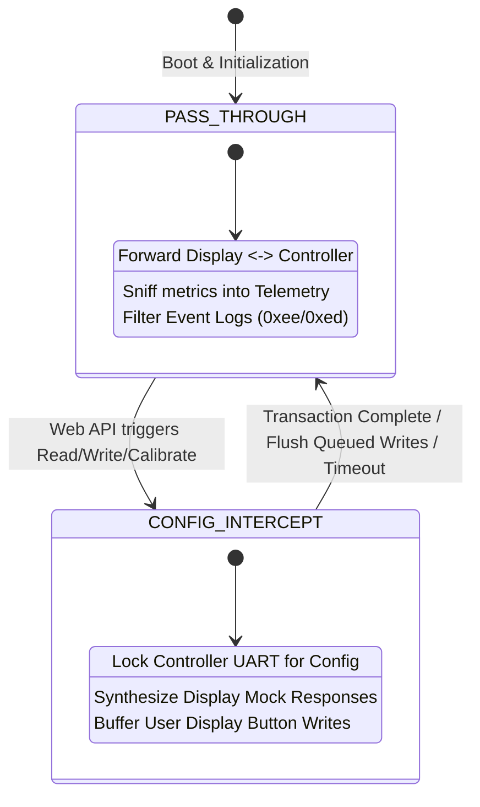

# AGENTS.md: Developer & Agent Handoff Reference

This document is the architectural and technical specification for AI agents and developers maintaining, refactoring, or extending the **BBS-HD ESP32-S3 Serial Middleman** codebase.

---

## 1. Project Domain & Context

* **Target Application**: Inline serial bridge and Wi-Fi management server for Bafang BBS-HD and BBS02 mid-drive electric bike motors running the third-party open-source firmware **[`bbs-fw`](https://github.com/danielnilsson9/bbs-fw)**.
* **Target Hardware**: ESP32-S3 (44-pin DevKitC-1 or equivalent, dual-core Xtensa LX7 @ 240MHz, 8MB Flash).
* **Physical Topology**:
  ```
  [ Bafang HMI Display ] <=== 5V TTL ===> [ Level Shifter ] <=== 3.3V ===> [ ESP32-S3 UART2 ]
  [ Bafang Motor Ctrl  ] <=== 5V TTL ===> [ Level Shifter ] <=== 3.3V ===> [ ESP32-S3 UART1 ]
                                                                             [ ESP32-S3 Wi-Fi ] <---> Phone / Laptop
  ```
* **Electrical Constraints**:
  * Motor/Display UARTs run at **5V TTL logic**. ESP32-S3 GPIOs are **3.3V max**. Level shifting is mandatory.
  * Baud rate is **1200 baud, 8N1** (1 byte $\approx$ 8.33 ms).
  * Battery Pack Voltage on Pin 1 is **36V–58.8V DC**. It must only feed the high-voltage DC-DC buck converter to supply 5V to the ESP32.

---

## 2. Core Architecture & State Machine

The middleman operates under a strict arbitration state machine defined in [`include/SerialBridge.h`](file:///home/kyle/dev/bbs-hd-middleman/include/SerialBridge.h):



### Mode 1: `BridgeState::PASS_THROUGH` (Normal Operation)
* **Display $\to$ Controller**:
  * Display queries (e.g. `0x11 0x08`, `0x11 0x20`) and writes (`0x16 0x0b`, `0x16 0x1a`) are forwarded directly to the controller.
  * Writes are inspected to immediately update local telemetry (`assistLevel`, `lightsOn`, `operationMode`).
* **Controller $\to$ Display**:
  * Response bytes are forwarded to the display.
  * Controller responses update telemetry (`motorCurrentAmps`, `batteryPercent`, `speedRpm`, `batteryVoltage`, `statusCode`).
  * **Event Log Interception**: `bbs-fw` sends asynchronous event logs (`0xee` 3-byte and `0xed` 5-byte frames). These are parsed, pushed to the web UI event log, and **swallowed** (not forwarded to the display) because standard displays do not support these frames and may glitch.

### Mode 2: `BridgeState::CONFIG_INTERCEPT` (Web Configuration)
* Triggered when the web interface calls `readConfig`, `writeConfig`, `resetConfig`, or `calibrateVoltage`.
* **Problem Solved**: At 1200 baud, transmitting a full 154-byte configuration payload takes $\sim 1.35$ seconds. If the display polls the controller during this window, packets collide and corrupt EEPROM. If the display is left unanswered for $> 1.5$ seconds, it triggers **Error 30**.
* **Arbitration Solution**:
  1. Middleman asserts `_state = CONFIG_INTERCEPT` and acquires `_bridgeMutex`.
  2. While communicating with the controller, incoming display read queries (`0x11 ...`) are intercepted.
  3. **Mock Synthesizer**: `synthesizeDisplayResponse(opcode)` immediately generates a valid, checksummed response to the display using cached telemetry. Display responds smoothly in $< 2$ ms with **zero Error 30**.
  4. If the user presses buttons on the display (write commands `0x16 ...`), they are buffered in `_queuedWrites[]`.
  5. Once the controller transaction completes, queued display commands are flushed to the controller, and state returns to `PASS_THROUGH`.

---

## 3. Protocol Specifications

### Checksum Algorithm
All packets (controller and display) utilize a simple 8-bit sum modulo 256:
$$\text{Checksum} = \left( \sum_{i=0}^{N-1} \text{byte}_i \right) \pmod{256}$$

### Controller Config Protocol (`bbs-fw`)
| Operation | Request Frame | Response Frame |
| :--- | :--- | :--- |
| **Read FW Version** | `0x01, 0x01, 0x02` | `0x01, 0x01, <maj>, <min>, <pat>, <cfgVer>, <ctrlType>, <chk>` (8 bytes) |
| **Read Config** | `0x01, 0x03, 0x04` | `0x01, 0x03, <version=5>, <len=154>, [154 config bytes], <chk>` (159 bytes) |
| **Write Config** | `0x02, 0xf1, 0x05, 0x9a, [154 config bytes], <chk>` | `0x02, 0xf1, <status: 1=OK, 0=Fail>, <chk>` (4 bytes) |
| **Reset Config** | `0x02, 0xf2, 0xf4` | `0x02, 0xf2, <status>, <chk>` (4 bytes) |
| **Calibrate Voltage** | `0x02, 0xf3, <v_hi>, <v_lo>, <chk>` | `0x02, 0xf3, <v_hi>, <v_lo>, <chk>` (5 bytes) |
| **Event Log Enable** | `0x02, 0xf0, <1/0>, <chk>` | `0x02, 0xf0, <1/0>, <chk>` (4 bytes) |

### Display Protocol (`Bafang HMI`)
| Query / Command | Opcode | Bytes | Description / Synthesizer Format |
| :--- | :---: | :---: | :--- |
| Read Status | `0x08` | 2 | Returns 1 byte status code (`0x00` = OK) |
| Read Current | `0x0a` | 2 | Returns `[amps * 2, amps * 2]` (2 bytes) |
| Read Battery | `0x11` | 2 | Returns `[percent, percent]` (2 bytes) |
| Read Speed | `0x20` | 2 | Returns `[rpm_hi, rpm_lo, chk + 0x20]` (3 bytes) |
| Read Moving | `0x31` | 2 | Returns `[0x30 or 0x31, chk]` (2 bytes) |
| Read Voltage | `0x24` | 3 | Returns `[volt_x10_hi, volt_x10_lo, chk]` (3 bytes) |
| Write PAS | `0x0b` | 4 | `0x16, 0x0b, <level_code>, <chk>` |
| Write Mode | `0x0c` | 4 | `0x16, 0x0c, <0x02=Std, 0x04=Sport>, <chk>` |
| Write Lights | `0x1a` | 3 | `0x16, 0x1a, <0xf0=Off, 0xf1=On>` |

### Debug Telemetry Frame (`0xEC`, bbs-fw fork)
The fork's `app_process()` periodically (every `DEBUG_TELEMETRY_INTERVAL_MS`, 500 ms) calls `eventlog_write_telemetry()` so the middleman can display live motor targets that the display protocol never exposes:

```
0xEC, target_current_percent, target_speed_percent, cadence_rpm_x10_hi, cadence_rpm_x10_lo, motor_rpm_x10_hi, motor_rpm_x10_lo, checksum
```

* `target_current_percent` / `target_speed_percent` are the final `motor_set_target_current()` / `motor_set_target_speed()` values (0–100).
* `cadence_rpm_x10` is `pas_get_cadence_rpm_x10()` (pedal cadence × 10).
* `motor_rpm_x10` is `hall_get_motor_rpm_x10()`: the motor output shaft speed × 10, measured from the three motor hall signals, which are wired to both the NEC motor controller and the STC. It is reported in output shaft (chainring / crank equivalent) rpm so it is directly comparable to the pedal cadence, and reads zero when the motor is not turning or on controllers whose hall routing has not been traced.
* Checksum is the usual 8-bit sum over the first seven bytes.
* It is only emitted while the event log is enabled (the middleman enables it at boot via `enableEventLog(true)`).
* The middleman parses it in both bridge paths — `processControllerRxPassThrough()` and `consumeControllerEventFrame()` — updates `TelemetryTracker::updateTargetTelemetry()`, and **swallows** it like the other event frames (never forwarded to the display). `/api/telemetry` exposes `hasTargetTelemetry`, `targetCurrentPercent`, `targetSpeedPercent`, `cadenceRpm` and `motorRpm`, which the dashboard "Motor Targets (bbs-fw)" card renders.

### Binary Configuration Struct Layout (Version 5, 154 Bytes)
Defined in [`include/BbsFwProtocol.h`](file:///home/kyle/dev/bbs-hd-middleman/include/BbsFwProtocol.h):
* Header fields: 34 bytes (limits, ramp rate, voltages, sensor enables, throttle bounds, PAS delays).
* `standard_levels[10]`: $10 \times 6 = 60$ bytes (`AssistLevel`: flags, current%, throttle%, cadence%, speed%, torque_amp).
* `sport_levels[10]`: $10 \times 6 = 60$ bytes.
* Total size: $34 + 60 + 60 = 154$ bytes (`#pragma pack(push, 1)`).

**Current firmware target: version 5.** The bbs-fw tree in use is based on commit `10cadba` (config version 5), so v5 is the layout that will actually be seen on the wire. The v6 support below is retained and version-gated but currently unused; no build-time switch is needed because the layout is chosen from the version the controller reports.

### Binary Configuration Struct Layout (Version 6, 192 Bytes)
Config v6 (bbs-fw fork commit "per-assist-level PAS min current and cadence taper, display target current") is **not** a superset of v5:
* Header fields: 32 bytes — the global `pas_keep_current_percent` / `pas_keep_current_cadence_rpm` are removed.
* `standard_levels[10]` / `sport_levels[10]`: $2 \times 10 \times 8 = 160$ bytes (`AssistLevelV6`: flags, max_current%, min_current%, taper_start_cadence_rpm, taper_end_cadence_rpm, max_throttle%, max_speed%, torque_amp).
* New flag `ASSIST_FLAG_DISPLAY_TARGET_CURRENT = 0x80` (show target current on the display instead of speed).
* `assist_mode_select` gains values 3–12 (`PASn + Lights toggles mode`) and 13 (`Brake switch toggles mode on boot`); v5 only knows 0–2.
* Total size: $32 + 160 = 192$ bytes.

**Version-aware tooling (critical):** the firmware only accepts a write whose `version`/`length` match its own `CONFIG_VERSION`, so the tool detects the controller version and switches layout:
* `SerialBridge::readConfig`/`writeConfig` take a version-tagged `BbsFwConfig` (`version`, `v5`, `v6` views) and frame v4 (152), v5 (154) or v6 (192) accordingly.
* `_configVersion` is learned from the FW-version response and the read-config header; `getConfigVersion()` is authoritative.
* `serializeConfigToJson`/`deserializeConfigFromJson` emit/consume the field set for `cfg.version` (`current`/`cadence` + global keep-current for v4/v5; `maxCurrent`/`minCurrent`/`taperStartCadence`/`taperEndCadence`/`displayTargetCurrent` for v6).
* `handlePostConfig` returns HTTP 409 if the posted `configVersion` differs from the controller's, so importing a v6 profile while attached to a v5 controller cannot zero the EEPROM.
* The web UI rebuilds its assist-level table columns from `configVersion` (`buildLevelTables(version)`), hides the global keep-current fields for v6, and extends the assist-mode options for v6.

### Wi-Fi Management (`WebPortal`)
The ESP32-S3 has a **single 2.4 GHz radio**, so AP+STA coexistence is slow. The portal is therefore **station-first**:
* If station credentials are stored, it joins the router in `WIFI_STA` only. On success it stays STA and the SoftAP + DNS captive portal are torn down.
* If the join does not complete within `STA_CONNECT_TIMEOUT_MS`, it runs an **async** channel scan (`WiFi.scanNetworks(true, true)`, never a blocking scan in `loop()`) and brings up a SoftAP on the least-congested of channels 1/6/11.
* If the station link drops, it waits `STA_LOST_GRACE_MS` for auto-reconnect before falling back to the SoftAP. Once on the SoftAP it does not retry the station until the user submits credentials again.
* `WiFi.setSleep(false)` is set in every mode for dashboard latency.
* The DNS server (`_dnsServer`, wildcard to the AP IP) runs **only while `_apActive`**. Captive-portal redirects (including `handleNotFound`) are likewise AP-only; in STA mode unknown paths return a real 404 so API typos stay debuggable.
* mDNS is advertised as `http://<MDNS_HOSTNAME>.local/` (default `bbshd.local`) in both modes via `MDNS.begin()`; the hostname and current mode are exposed by `/api/info`.
* All lifecycle work happens non-blockingly in `WebPortal::process()` driven by the `WifiPhase` state machine (`StaConnecting` → `StaConnected` / `ApScanning` → `ApOnly`). Never add a blocking wait here — it would stall `Bridge.process()` and overrun the 1200-baud UART.

### Web UI Polling Budget
The dashboard polls `/api/telemetry` (1.5 s), `/api/events` (3 s), and — only while the Debug Console toggle is on and its tab is visible — `/api/serial-trace` (0.5 s). All polling functions bail out when `document.hidden`. `DebugLog` tracing is disabled by default (`DEBUG_TRACE_ENABLED_DEFAULT 0`) so an idle device generates no trace traffic.

---

## 4. Codebase Navigation

```
/home/kyle/dev/bbs-hd-middleman/
├── platformio.ini         # PlatformIO build config (espressif32@6.12.0, ESP32-S3 DevKitC-1)
├── README.md              # Human-facing guide (BOM, wiring diagrams, user manual)
├── AGENTS.md              # This file (Agent handoff reference & technical specs)
├── include/
│   ├── Config.h           # Hardware pins, Wi-Fi credentials, timeouts, buffer sizes
│   ├── BbsFwProtocol.h    # Opcodes, structs, bitmasks, checksums, JSON serialization
│   ├── Telemetry.h        # Thread-safe metrics tracker & event log ring buffer
│   ├── SerialBridge.h     # Dual UART engine, state machine, mock synthesizer
│   ├── WebContent.h       # Single-page HTML5/CSS/JS dashboard stored in PROGMEM
│   └── WebPortal.h        # WebServer, REST APIs, DNS Captive Portal, Wi-Fi manager
└── src/
    ├── main.cpp           # Setup, cooperative loop, status LED heartbeat
    ├── BbsFwProtocol.cpp  # JSON <-> struct converters, event log string table
    ├── Telemetry.cpp      # Metric calculations, speed math, JSON builder
    ├── SerialBridge.cpp   # Non-blocking UART streaming, arbitration logic
    └── WebPortal.cpp      # HTTP route endpoints, captive portal redirections
```

---

## 5. Build, Flash & Validation

### PlatformIO Environment
* **Platform**: `espressif32@6.12.0` (Use this exact version to ensure stable Xtensa toolchains).
* **Board**: `esp32-s3-devkitc-1`
* **Dependencies**: `bblanchon/ArduinoJson @ ^7.0.0`
* **Build Flags**:
  * `-DARDUINO_USB_CDC_ON_BOOT=1` (routes debug `Serial` through ESP32-S3 native USB)
  * `-DARDUINO_USB_MODE=1`

### CLI Commands
```bash
# Build firmware binary
/home/kyle/.platformio/penv/bin/pio run

# Flash to connected ESP32-S3
/home/kyle/.platformio/penv/bin/pio run -t upload

# Open Serial Monitor (115200 baud)
/home/kyle/.platformio/penv/bin/pio device monitor
```

---

## 6. Critical Rules for AI Agents Modifying Code

1. **Never Change Struct Packing**:
   [`BbsFwConfigV5`](file:///home/kyle/dev/bbs-hd-middleman/include/BbsFwProtocol.h#L66-L122) and [`AssistLevel`](file:///home/kyle/dev/bbs-hd-middleman/include/BbsFwProtocol.h#L57-L64) MUST remain `#pragma pack(push, 1)`. Modifying byte alignment or reordering fields will corrupt the controller's EEPROM.
2. **Never Introduce Blocking Delays in the Main Loop**:
   Both `Bridge.process()` and `Portal.process()` must run cooperatively on every iteration of `loop()`. Long delays in `loop()` cause UART buffer overruns at 1200 baud.
3. **Preserve Display Keep-Alive Mock Responses**:
   Any new controller transactions that block the normal bridge MUST use the pattern in `sendAndReceiveController()`:
   * Keep servicing `processDisplayRxIntercept()` while waiting for controller bytes.
   * Synthesize immediate responses to display queries so the display never times out.
4. **Zero External CDN Dependencies in Web Content**:
   All CSS, JavaScript, and HTML in [`include/WebContent.h`](file:///home/kyle/dev/bbs-hd-middleman/include/WebContent.h) must remain self-contained. Bikes are ridden in areas without internet connectivity.
5. **Always Verify Compilation Before Finishing**:
   Always run `/home/kyle/.platformio/penv/bin/pio run` to verify that code builds cleanly with zero errors and zero warnings.
